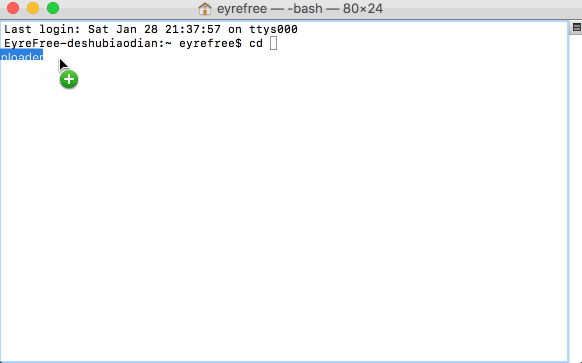

# YinYueTaiDownloader

YinYueTaiDownloader is a script to download .flv from [http://www.yinyuetai.com/](http://www.yinyuetai.com/) by ID without the `Yinyuetai Client`.

## Overview



## Requirements

- Python

## Use

```python
python YinYueTaiDownloader.py
```

## PS

Modified from [https://github.com/firstg/yinyuetai](https://github.com/firstg/yinyuetai)

1. Fixed problem of finding title from the html;
2. Fixed problem with FLV path in OS X.

## License

YinYueTaiDownloader is available under the MIT license. See the LICENSE file for more info.
